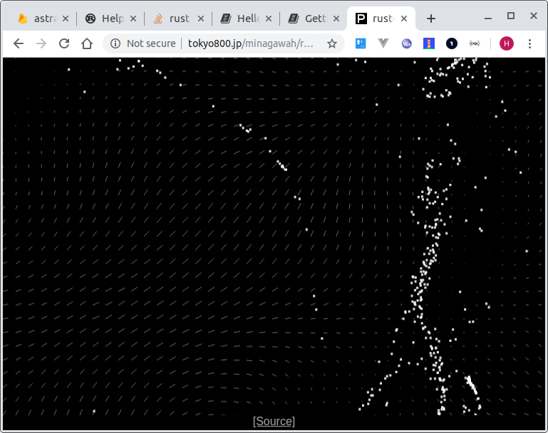

# rust-perlin-wasm-test

Generates wind blown particles using WASM.

[1. About](#about)  
[2. Develop](#dev)  
&nbsp; [2-1. Rust](#dev-rust)  
&nbsp; [2-2. Node.js](#dev-node)  
&nbsp; [2-3. MIME TYPE](#dev-mime)  
[3. Installed NPM Packages](#installed-npm)  
[4. Notes](#notes)  
[5. LICENSE](#license)  


<a id="about"></a>
## 1. About

Nothing very fancy.  
Just calling from browser the perlin noise generator provided by one of Rust's crates,
[noise](https://docs.rs/noise/0.5.1/noise/).  
Currently, the array iteration for making a vector field (of wind vectors)
is done by Javascript. Hopefully, I will let Rust do the job instead.

[View Demo](http://tokyo800.jp/minagawah/rust-perlin-wasm-test/)

**Check out [rust-perlin-wasm-test-2](https://github.com/minagawah/rust-perlin-wasm-test-2/)
which is another attempt to accomplish the same
except it uses [wasm-pack](https://github.com/rustwasm/wasm-pack)
instead of wholly depends on the `nightly` toolchain.**




<a id="dev"></a>
## 2. Develop

If you were to try it yourself, you need `Node.js` and `Rust`.

<a id="dev-rust"></a>
## 2-1. Rust

If you are using `rustup`, change your default toolchain to `nightly`.

```
rustup default nightly
```

You need `wasm32-unknown-unknown`.

```
rustup target add wasm32-unknown-unknown
```

You need `wasm-gc` (to optimise the WASM binary).

```
cargo instal wasm-gc
```

<a id="dev-node"></a>
## 2-2. Node.js

### # ts-node

```
yarn global add ts-node
```

### # git clone

```
git clone https://github.com/minagawah/rust-perlin-wasm-test.git
```

### # Run

**dev**

```
yarn run serve
```

**prod**

```
yarn run build
```

<a id="dev-mime"></a>
## 2-3. MIME TYPE

Simply uploading WASM file to the remote server won't work.  
In order for `WebAssembly.instantiateStreaming`, fetching API, to work,
your server must send a MIME header specific to the WASM file.  
If you don't have an access to the server hosting the WASM file,
there is a workaround which first extracts `ArrayBuffer` out of the file:  
https://stackoverflow.com/questions/52239924/webassembly-instantiatestreaming-wrong-mime-type#answer-52732080  
Otherwise, access your hosting server, and simply set to your `.htaccess`:

```
AddType application/wasm .wasm
```


<a id="installed-npm"></a>
## 3. Installed NPM Packages

```
yarn global add ts-node

yarn add typescript ts-loader eslint @typescript-eslint/parser @typescript-eslint/eslint-plugin webpack webpack-cli webpack-dev-server file-loader html-loader css-loader style-loader postcss-loader autoprefixer html-webpack-plugin copy-webpack-plugin clean-webpack-plugin mini-css-extract-plugin webpack-manifest-plugin license-webpack-plugin webpack-merge tape @types/tape --dev

yarn add debounce-ctx
```


<a id="notes"></a>
## 4. Notes

```
https://users.rust-lang.org/t/wasm-unknown-vs-emscripten/22997/2
IIUC wasm32-unknown-emscripten can be viewed as a legacy, "hacky" approach,
so I think you should prefer using wasm32-unknown-unkown with wasm-bindgen or stdweb if possible.

https://qiita.com/legokichi/items/5d6344314ab6d6633554
wasm-bindgen: 基本的な型のなどが入ったクレート
js-sys: Rust から JavaScript の値を生成するためのクレート
web-sys: Rust から DOM とかを叩くためのクレート
wasm-bindgen-futures: Rust の Future と JavaScript の Promise の型を相互変換するためのクレート
wasm-bindgen-cli: wasm-bindgen や js-sys や web-sys クレートを使って生成した wasm ファイルに Rust と JS の FFI のランタイムを追加するビルドツール
wasm-pack: wasm-bindgen を使った Rust コードを npm の package.json から呼ぶための設定ファイルを出力するビルドツール

Rust and WebAssembly
https://rustwasm.github.io/docs/book/print.html
```


<a id="license"></a>
## 5. License

Provided under [WTFPL](./LICENSE).  
Remember, there are some NPM libraries that are under certain license restrictions.
